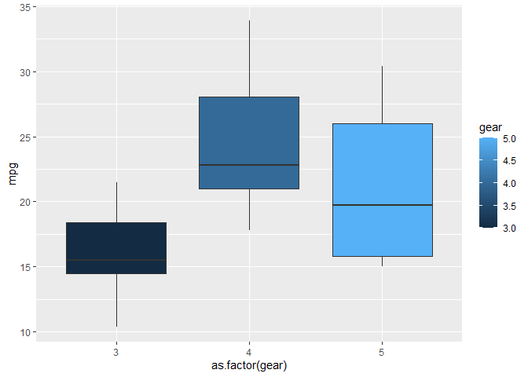
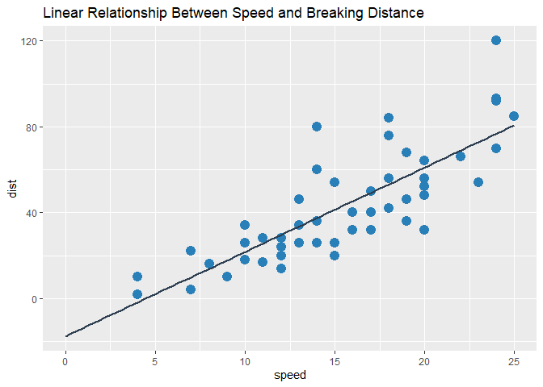
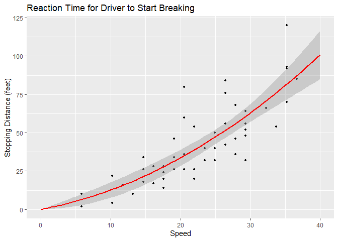

Advanced Bioinformatics 2021 assessment
================
m1906710
14/04/2021

# Task 1

``` r
x = 5:55
# represents the numbers from 5 to 55
sum (x)
```

    ## [1] 1530

``` r
# This is the sum of numbers from 5 to 55
```

# Task 2

``` r
sumfun <- function(n)
  sum(5:n)
# assigned variable sumfun the function n.

sumfun(10)
```

    ## [1] 45

``` r
# sum(5:10). Sum of numbers from 5 to 10

sumfun(20)
```

    ## [1] 200

``` r
# sum(5:20). Sum of numbers from 5 to 20

sumfun(100)
```

    ## [1] 5040

``` r
# sum(5:100). Sum of numbers from 5 to 100
```

# Task 3

``` r
# Fibonaaci series
Flare <- function(a) {
  if(a <= 1) {
    return(a)
  } else {
    return(Flare(a-1) + Flare(a-2))
  }
}
# Assigned variable Flare the function a.
# Function a is returned if the a function is less or equal to 1. Otherwise the function a -1 added to the function a -2 is returned.
for(x in 1:12){
print(Flare(x))
}
```

    ## [1] 1
    ## [1] 1
    ## [1] 2
    ## [1] 3
    ## [1] 5
    ## [1] 8
    ## [1] 13
    ## [1] 21
    ## [1] 34
    ## [1] 55
    ## [1] 89
    ## [1] 144

``` r
# The for loop where the loop variable is x and expression 1 is numbers 1 to 12 using the operator :. Expression 2 prints function a in terms of the loop variable. 
```

# Task 4

``` r
library(ggplot2)
# This loads ggplot 
ggplot(data=mtcars, aes(x=as.factor(gear), y=mpg, fill=gear)) + geom_boxplot()
```

<!-- -->

``` r
# The function ggplot initiates a new plot. Data used is mtcars. Graph represents miles per gallon as a fuctnion of then number of gears
# fill is used to fill in gears
# geom_boxplot is what determines the graph to be a boxplot.
```

# Task 5

``` r
y<- cars$dist; x<- cars$speed
type<- lm(formula = "y~x")
type
```

    ## 
    ## Call:
    ## lm(formula = "y~x")
    ## 
    ## Coefficients:
    ## (Intercept)            x  
    ##     -17.579        3.932

``` r
# distance from cars data set assigned variable y. speed from cars data set assigned variable x.

summary(type)
```

    ## 
    ## Call:
    ## lm(formula = "y~x")
    ## 
    ## Residuals:
    ##     Min      1Q  Median      3Q     Max 
    ## -29.069  -9.525  -2.272   9.215  43.201 
    ## 
    ## Coefficients:
    ##             Estimate Std. Error t value Pr(>|t|)    
    ## (Intercept) -17.5791     6.7584  -2.601   0.0123 *  
    ## x             3.9324     0.4155   9.464 1.49e-12 ***
    ## ---
    ## Signif. codes:  0 '***' 0.001 '**' 0.01 '*' 0.05 '.' 0.1 ' ' 1
    ## 
    ## Residual standard error: 15.38 on 48 degrees of freedom
    ## Multiple R-squared:  0.6511, Adjusted R-squared:  0.6438 
    ## F-statistic: 89.57 on 1 and 48 DF,  p-value: 1.49e-12

``` r
#Intercept: -17.5791 Fitted Slope: 3.9324 Standard Deviation Speed: 0.4155 Standard Deviation Distance: 6.7584
```

# Task 6

``` r
library(grid)
library(gridExtra)
library(gtable)
lm.scatter <- ggplot(cars, aes(x=speed, y=dist)) +
  geom_point(color='#2980B9', size = 4) + xlim(c(0, 25)) +
  geom_smooth(method=lm, se=FALSE, fullrange=TRUE, color='#2C3E50') + 
  labs(title='Linear Relationship Between Speed and Breaking Distance')
grid.arrange(lm.scatter)
```

    ## `geom_smooth()` using formula 'y ~ x'

<!-- -->

``` r
# The grid, girdExtra and gtable are loaded
```

# Task 7

``` r
new_speed <- cars$speed * (5280/3600)
line<-lm(dist ~ 0+ new_speed + I(new_speed^2),cars)
summary(line)
```

    ## 
    ## Call:
    ## lm(formula = dist ~ 0 + new_speed + I(new_speed^2), data = cars)
    ## 
    ## Residuals:
    ##     Min      1Q  Median      3Q     Max 
    ## -28.836  -9.071  -3.152   4.570  44.986 
    ## 
    ## Coefficients:
    ##                Estimate Std. Error t value Pr(>|t|)   
    ## new_speed       0.84479    0.38180   2.213  0.03171 * 
    ## I(new_speed^2)  0.04190    0.01366   3.067  0.00355 **
    ## ---
    ## Signif. codes:  0 '***' 0.001 '**' 0.01 '*' 0.05 '.' 0.1 ' ' 1
    ## 
    ## Residual standard error: 15.02 on 48 degrees of freedom
    ## Multiple R-squared:  0.9133, Adjusted R-squared:  0.9097 
    ## F-statistic: 252.8 on 2 and 48 DF,  p-value: < 2.2e-16

``` r
library(ggplot2)
# This loads ggplot
y <- cars$dist; x <- cars$new_speed
# Distance in car data is assigned variable y; The variable new_speed is assigned the variable x
ggplot(cars,aes(new_speed,dist)) +
  geom_point(color='Black', size = 1) + xlim(c(0,40)) +
  geom_smooth(method = "lm", formula = "y ~ 0 + x + I(x^2)",  color="red", fullrange='TRUE') + labs(title= 'Reaction Time for Driver to Start Breaking ', y = 'Stopping Distance (feet)', x = "Speed")
```

<!-- -->

``` r
# The first line starts ggplot using car data set - Where x is new_speed and y is distance
# The second line plots a scatter plot.The colour of dots are black and the size is 1. 
# xlim is used to set the x-axis limits between 0 to 40
# The result 0.84479 can be deemed a resonable reaction speed
```
